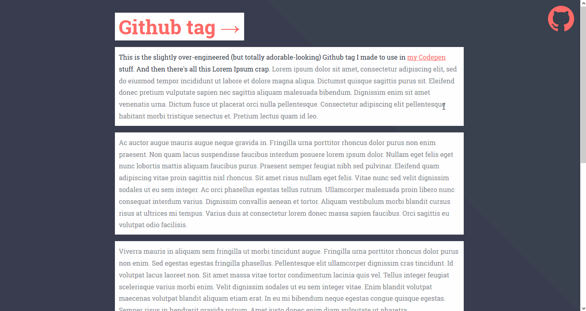

# Octocat tag

This is the slightly over-engineered (but totally adorable-looking) Github tag I made to use in [my Codepen](https://codepen.io/anacoxta) stuff.  

 

You can also see it in action over there:  

